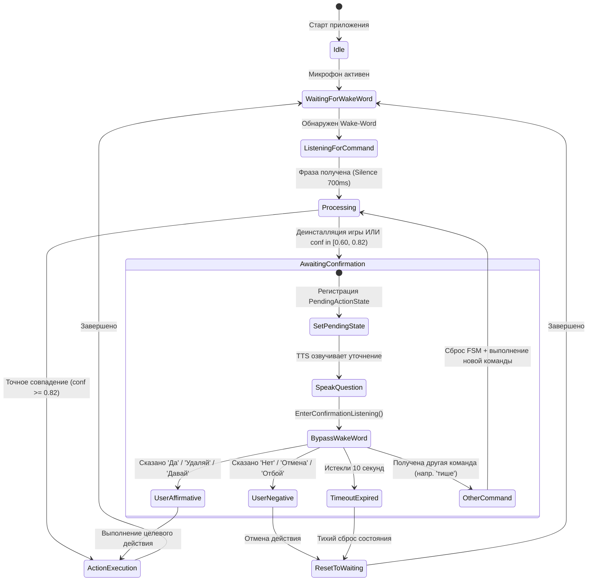

# JARVIS — Техническая карта архитектуры (ARCHITECTURE.md)

Документ предназначен для быстрой контекстной ориентации AI-агента в среде AntiGravity IDE. Содержит схемы пайплайна, порядок диспетчеризации, каталог сервисов, описание FSM-состояний и правила разработки для будущих задач.

---

## 1. High-Level Flow (Пайплайн голосового запроса)

Полный жизненный цикл обработки пользовательского ввода: от снятия звука с аудиокарты до выполнения низкоуровневых Win32-действий и голосового ответа.

```mermaid
flowchart TD
    MIC([Микрофон / NAudio WaveIn]) -->|16kHz 16-bit PCM| VL[VoiceListener]
    
    subgraph VoiceListener_FSM [VoiceListener State Machine]
        VL -->|WaitingForWakeWord| WWF{WakeWordFactory}
        WWF -->|По умолчанию: все имена, включая 'джарвис'| VOSK_WW[VoskGrammarWakeWordDetector / vosk-model-small-ru]
        WWF -.->|Опционально: ONNX KWS| ONNX_WW[OpenWakeWordDetector / ONNX jarvis.onnx]
        
        VOSK_WW -->|Детекция: БЕСШУМНО без бипов| ACL[ListeningForCommand]
        ONNX_WW -->|Детекция: БЕСШУМНО без бипов| ACL
        ACL -->|Поток на vosk-model-ru-0.42| VOSK[Vosk STT Engine]
        VOSK -->|Silence Timeout 700ms| CMD_READY[Команда сформирована]
    end

    CMD_READY --> DUAL_PATH[LlmIntentService: Dual-Path Router]

    subgraph Routing_Engine [Dual-Path Routing Engine]
        DUAL_PATH -->|1. TryFastMatch < 5ms| FAST{Быстрый путь?}
        FAST -->|HIT: Media, Volume, Timer, App, FSM| DIRECT_RESP[JarvisResponse]
        FAST -->|MISS: Free Query / Ambiguous| LLM_CALL[LM Studio API / Qwen2.5]
        LLM_CALL --> DIRECT_RESP
    end

    DIRECT_RESP --> ROUTER[CommandRouter]
    
    subgraph Execution_Layer [Execution & Handlers]
        ROUTER -->|command: volume| VOL_H[VolumeCommandHandler / CoreAudioApi]
        ROUTER -->|command: media| MED_H[MediaCommandHandler / SendInput]
        ROUTER -->|command: timer| TIM_H[TimerCommandHandler / TimerService]
        ROUTER -->|command: app| APP_H[AppControlCommandHandler / SteamService]
        ROUTER -->|command: system| SYS_H[SystemCommandHandler / Exit]
        ROUTER -->|command: weather| WTH_H[WeatherCommandHandler / WeatherService]
        ROUTER -->|command: hotkey| HTK_H[HotkeyCommandHandler / SendInput]
    end

    DIRECT_RESP -->|reply: text| VFS[IVoiceFeedbackService]
    VFS --> TTS[CompositeVoiceFeedbackService]

    subgraph TTS_Pipeline [Resilient TTS Pipeline - Strictly Male Voices]
        TTS -->|1. Primary (EnableEdgeTts=true)| EDGE[EdgeTtsEngine / ru-RU-DmitryNeural + 5000ms Connect + Retry Policy 2 retries с FastReconnect 3000ms]
        EDGE -.->|Failover on All Retries Exhausted| SAPI[SystemSpeechTtsEngine / SAPI5: Direct COM Token Aidar (Russian) -> Microsoft Pavel fallback -> pitch-shift]
        TTS -->|Pause / Resume & Confirmation| VL
    end
```

### Пошаговое прохождение запроса:
1. **Захват звука (`VoiceListener.cs`)**: Поток PCM 16 кГц проходит через встроенный **RMS Energy Gate (порог 400–500, по умолчанию 450)**. Кадры с энергией ниже порога классифицируются как тишина/фоновый шум и отбрасываются до передачи в распознаватель, предотвращая галлюцинации модели на дыхании, сопении и шуме комнаты.
2. **Адаптивная детекция активации (БЕЗ ЗВУКОВЫХ СИГНАЛОВ)**:
   - В состоянии `WaitingForWakeWord` фабрика `WakeWordFactory` направляет поток:
     - В `VoskGrammarWakeWordDetector` (малая модель `vosk-model-small-ru` с жесткой грамматикой `["{targetName}", "[unk]"]`, маршалируемой строго как UTF-8 через нативный P/Invoke) по умолчанию для целевого слова «джарвис» и любых кастомных имен.
     - Опционально в `OpenWakeWordDetector` (OnnxRuntime `jarvis.onnx`).
   - **Фильтрация акустической длительности слова (Порог: 150 мс)**: длительность звучания фразы должна составлять **не менее 150 мс** (`minDurationMs = 150`). Одиночные звуковые всплески, чихи, вздохи, кашель и обрывки «джа», «да» длительностью < 150 мс игнорируются.
   - **Строгий токен-матчинг**: целевое слово проверяется строго как изолированный токен через регулярное выражение `(?:\b|\s|^)джарвис(?:\b|\s|$)` и токенную десериализацию, исключая ложные срабатывания на суффиксы и похожие слова («джарвиса», «сюрприз», «рис», «вис»).
   - При обнаружении имени **НЕ ПРОИЗВОДИТСЯ никаких звуковых сигналов (никаких Console.Beep, джинглов или проигрывания звуков)**.
   - Происходит мгновенный бесшумный переход в `ListeningForCommand` (HUD переключается в `Listening`), и поток PCM переключается на полноразмерную акустическую модель `vosk-model-ru-0.42` (~1.5 ГБ) для приема команды.
   - При истечении тишины (700 мс после окончания речи) формируется итоговая строка фразы без дробления слов на паузах.
3. **Dual-Path Диспетчеризация (`LlmIntentService.cs`)**:
   - Сначала вызывается `TryFastMatch(spokenText)` (выполняется строго `< 5 мс`, без сетевых запросов).
   - Системные приложения (`browser`, `notepad`, `calc`, `explorer`, `discord`, `telegram`, `steam`) проверяются **до** обобщенного поиска игр Steam, полностью исключая ложноположительные коллизии (например, «открой браузер» $\to$ «Graveyard Keeper»).
   - Выводятся трейсы маршрутизации: `[Router: FastMatch] Анализ фразы: ...` и `[Router: FastMatch] HIT -> ...` или `[Router: FastMatch] MISS -> Перенаправление в LLM (InterpretAsync)...`.
   - Если совпадение найдено, формируется типизированный `JarvisResponse` с объектом `CommandRequest` и текстом `Reply`.
   - Если быстрое совпадение отсутствует, запрос уходит в `InterpretAsync()` к локальной LLM (LM Studio / OpenAI-compatible API).
4. **Маршрутизация (`CommandRouter.cs`)**:
   - Если в ответе присутствует `CommandRequest`, роутер логирует `[Router: Dispatch] Маршрутизация команды...`, находит зарегистрированный `ICommandHandler` и вызывает `ExecuteAsync()`, после чего логирует `[Router: Result]`.
5. **Голосовой синтез (`IVoiceFeedbackService` / `CompositeVoiceFeedbackService.cs`)**:
   - Все обработчики и пайплайн вызывают единую абстракцию `IVoiceFeedbackService.SpeakAsync(text)`.
   - **Primary**: `EdgeTtsEngine` (`ru-RU-DmitryNeural`, базовый таймаут подключения 5000 мс, политика повторов Retry Policy до 2 повторных попыток переподключения при сетевых заминках/ошибках сокета, сброс счетчика ошибок при успехе, Keep-Alive пинг WebSocket). Не сбрасывает Дмитрия при первых задержках сети.
   - **Offline / Fallback**: `SystemSpeechTtsEngine` (Windows SAPI5: проект полностью отказался от поиска `.onnx` моделей и локального ONNX-инференса Silero через файлы; активация Silero происходит исключительно через установленный в систему Windows SAPI5-драйвер с прямым COM-биндингом токена `Aidar (Russian)` / `Baya (Russian)`; в качестве аварийного оффлайн-фоллбэка активируется системный мужской голос `Microsoft Pavel` без необработанных исключений и предупреждений в консоли; женский голос `Microsoft Irina Desktop` категорически заблокирован; при отсутствии мужских голосов — модуляция тона `-40% prosody`).
   - **Двухконтурная блокировка микрофона (FSM Processing Lock & Acoustic Echo Suppression)**:
     - При фиксации финальной команды немедленно выставляется `_isProcessing = true`, полностью блокируя захват новых команд и вейк-ворда на время работы LLM и роутера.
     - На время синтеза речи TTS выставляется `_isSpeaking = true`.
     - Разблокировка слушателя микрофона (`_isProcessing = false`, `_isSpeaking = false`) выполняется строго после окончания воспроизведения TTS и истечения защитного окна cooldown (**250 мс**) в блоке `finally`.
   - Если действие требует подтверждения пользователя (`HasPendingAction`), вопрос подтверждения озвучивается ровно один раз, дублирующий `response.Reply` блокируется, а микрофон переводится в режим прямого ожидания ответа без вейк-ворда (`EnterConfirmationListening`).


---

## 2. Dual-Path Routing & Order of Execution

Для исключения регрессий и гонок между регулярными выражениями в `TryFastMatch()` зафиксирован строгий порядок приоритетов.

| Приоритет | Категория | Обработчик / Сервис | Типичные фразы | Почему этот приоритет |
|---|---|---|---|---|
| **1** | **PendingAction (FSM)** | `JarvisOrchestrator` | `да`, `нет`, `отмена`, `удаляй`, `запускай` | **Критический**: предотвращает перехват слов согласия/отмены медиаплеером, таймером или отправку в LLM. |
| **2** | **Media Keys** | `MatchMediaCommand` / `MediaKeyService` | `пауза`, `стоп`, `музыка`, `запусти музыку`, `поставь трек`, `поставь песню`, `следующий трек`, `предыдущий` | **0 мс задержка**: Win32 SendInput клавиш `VK_MEDIA_*`. Regex-паттерн с `$`-якорем исключает перехват имён игр Steam. Изолирован от поиска приложений. |
| **3** | **Volume / Audio** | `VolumeCommandHandler` / `NAudio` | `тише`, `громче`, `звук 50`, `выключи звук`, `мут` | Высокочастотные системные команды, не требующие работы парсера таймеров или Steam. |
| **4** | **Timers & Reminders** | `MatchTimerCommand` / `TimerService` | `поставь таймер на 10 минут`, `напомни через 5 мин`, `сколько осталось` | Быстрый regex-парсер времени. Проверяется до Steam во избежание коллизий типа *"поставь таймер"* vs *"поставь киберпанк"*. |
| **5** | **System / Hotkeys / Apps** | `AppHandler` / `AppControlCommandHandler` / `HotkeyCommandHandler` | `закройся`, `открой браузер`, `проводник`, `блокнот`, `сверни все`, `открой калькулятор` | Управление окнами, процессами и системными программами. Строго изолировано от каталога Steam во избежание ложных коллизий. |
| **6** | **SteamService** | `SteamService` | `установи киберпанк`, `запусти ведьмак`, `удали астра ниро` | Фонетический поиск, Levenshtein, запуск или инициация диалога подтверждения деинсталляции/установки. |
| **7** | **LLM Fallback** | `LlmIntentService.InterpretAsync` | Свободный диалог, извлечение городов, нетривиальные намерения | Резервный канал при возврате `null` из `TryFastMatch()`. |

---

## 3. Каталог файлов, сервисов и зон ответственности

### 3.1 Ядро (`Core/`)
- [`Core/ICommandHandler.cs`](file:///c:/Users/evsee/OneDrive/Desktop/Gem/Core/ICommandHandler.cs): Единый интерфейс для всех обработчиков (`CommandName`, `ExecuteAsync`).
- [`Core/CommandRequest.cs`](file:///c:/Users/evsee/OneDrive/Desktop/Gem/Core/CommandRequest.cs): Неизменяемый DTO входящей команды (`Command`, аргументы `Args` в формате `JsonElement`).
- [`Core/CommandResult.cs`](file:///c:/Users/evsee/OneDrive/Desktop/Gem/Core/CommandResult.cs): Результат исполнения (`Success`, `Message`, `Data`). Фабричные методы `Ok()` и `Fail()`.
- [`Core/CommandRouter.cs`](file:///c:/Users/evsee/OneDrive/Desktop/Gem/Core/CommandRouter.cs): Диспетчер команд. Регистрация через fluent API `.Register()`, валидация JSON и асинхронная маршрутизация.
- [`Core/JarvisState.cs`](file:///c:/Users/evsee/OneDrive/Desktop/Gem/Core/JarvisState.cs): Enum состояний HUD: `Idle`, `Listening`, `Thinking`, `Action`.

#### 3.2 Сервисы захвата речи и адаптивного Wake-Word (`Voice/`, `Voice/WakeWord/`)
- [`Voice/WakeWord/IWakeWordDetector.cs`](file:///c:/Users/evsee/OneDrive/Desktop/Gem/Voice/WakeWord/IWakeWordDetector.cs):
  - Базовый контракт потокового детектора активации (`Name`, `WakeWord`, `ProcessFrame(ReadOnlySpan<byte> pcmData)`, `event Action OnWakeWordDetected`, `Reset()`).
- [`Voice/WakeWord/OpenWakeWordDetector.cs`](file:///c:/Users/evsee/OneDrive/Desktop/Gem/Voice/WakeWord/OpenWakeWordDetector.cs):
  - Высокоскоростной детектор на базе `Microsoft.ML.OnnxRuntime` для целевого слова «Джарвис».
  - Легковесная модель `Models/WakeWord/jarvis.onnx` со сверхнизкой задержкой кадра (50–80 мс).
  - Автоматическая фоновая загрузка модели при её отсутствии в локальной файловой системе.
- [`Voice/WakeWord/VoskGrammarWakeWordDetector.cs`](file:///c:/Users/evsee/OneDrive/Desktop/Gem/Voice/WakeWord/VoskGrammarWakeWordDetector.cs):
  - KWS-детектор по умолчанию для целевого слова («джарвис») и любых кастомных имен («петрович», «гена», «цицерон» и др.).
  - Использует малую акустическую модель `vosk-model-small-ru` (~45 МБ, автозагрузка при отсутствии) с жестко ограниченной грамматикой `["{customName}", "[unk]"]`.
  - Маршалинг грамматики выполняется **строго как UTF-8** через нативный P/Invoke (`vosk_recognizer_new_grm` с `LPUTF8Str`), устраняя предупреждение Kaldi `Ignoring word missing in vocabulary: ''`. Небезопасный fallback на стандартный конструктор `VoskRecognizer(Model, float, string)` (без гарантии UTF-8) полностью исключён: при недоступности Reflection бросается явное `InvalidOperationException` с диагностическим сообщением.
  - **RMS Noise Gate (`NoiseGateRms: 450.0`)**: входящие аудио-фреймы проверяются на энергию сигнала (Root Mean Square). Фреймы с `RMS < 450.0` классифицируются как тишина/фоновый шум и отбрасываются до передачи в распознаватель Vosk.
  - **Акустический порог минимальной длительности (`MinDurationMs: 150`)**: подсчет длительности звуковых фреймов (1 мс = 32 байта для 16 кГц 16-бит моно PCM). Срабатывание KWS разрешено только при накопленной длительности $\ge 150$ мс, что полностью отсекает вздохи, кашель, щелчки и мгновенные импульсы. При паузах > 120 мс или тишине > 200 мс накопленная длительность сбрасывается.
  - **Защита KWS от ложных срабатываний (Token Matching)**: проверка детекции вейк-ворда выполняется строго через скомпилированный `Regex` с изоляцией токенов `(?:\b|\s|^){customName}(?:\b|\s|$)` и парсинг токенов Vosk JSON. Подстрочные проверки (`Contains`) запрещены, что полностью блокирует ложные срабатывания на фонетические обрывки («джа», «рис», «вис») и дыхательный/фоновый шум.
- [`Voice/WakeWord/WakeWordFactory.cs`](file:///c:/Users/evsee/OneDrive/Desktop/Gem/Voice/WakeWord/WakeWordFactory.cs):
  - Фабрика: по умолчанию инициализирует `VoskGrammarWakeWordDetector` для мгновенной 0 мс детекции как для имени «джарвис», так и для кастомных имен с передачей параметров `NoiseGateRms` и `MinDurationMs`.
- [`Services/VoiceListener.cs`](file:///c:/Users/evsee/OneDrive/Desktop/Gem/Services/VoiceListener.cs):
  - Потоковый захват микрофона (`NAudio.Wave.WaveInEvent`, 16 кГц, 1 канал, 16 бит).
  - Входная фильтрация по уровню RMS в `OnAudioDataAvailable`: фреймы тишины и низкоамплитудного фонового шума (`RMS < 450.0`) отсекаются до обработки KWS/STT.
  - Интеграция с `IWakeWordDetector` в состоянии `WaitingForWakeWord`.
  - **Двухконтурная блокировка микрофона (FSM Processing Lock & Acoustic Echo Suppression)**:
    - При фиксации команды мгновенно активируется `NotifyProcessingStarted()` (`_isProcessing = true`), блокируя захват новых фраз на всё время маршрутизации команды и сетевой генерации ответа LLM.
    - Во время воспроизведения TTS выставляются флаги `_isPaused` и `_isSpeaking`, входящие PCM-фреймы микрофона аппаратным образом отбрасываются до попадания в KWS и STT, буферы распознавателя сбрасываются.
    - Разблокировка микрофона (`NotifyProcessingFinished()`, `_isProcessing = false`, `_isSpeaking = false`) выполняется строго в блоке `finally` после завершения TTS и защитного окна затухания акустического эха (250 мс cooldown).
  - **Полная бесшумность**: фиксация имени происходит мгновенно и без звуковых сигналов (никаких Console.Beep, джинглов или проигрывания аудио).
  - Мгновенный переброс в `ListeningForCommand` с передачей аудиопотока в полноразмерную модель `vosk-model-ru-0.42` (~1.5 ГБ, каталог `./model`).
  - Потокобезопасный синглтон модели Vosk (`_sharedModel`) с оптимизацией каталога (`rescore`/`rnnlm` изоляция) для удержания RAM < 2 ГБ.
  - Сессионная буферизация фраз с таймаутом естественной тишины 700 мс.
  - Метод `EnterConfirmationListening()` для прямого захвата ответа без вейк-ворда.
- [`Services/LlmIntentService.cs`](file:///c:/Users/evsee/OneDrive/Desktop/Gem/Services/LlmIntentService.cs):
  - Метод `TryFastMatch()`: 0 мс роутинг команд без обращения к LLM.
  - Интеграция с локальной LLM по стандарту OpenAI Chat Completions API (`POST /v1/chat/completions`).
  - Системный промпт с JSON-схемой и скользящая история диалога (до 6 сообщений).
- [`Services/JarvisOrchestrator.cs`](file:///c:/Users/evsee/OneDrive/Desktop/Gem/Services/JarvisOrchestrator.cs):
  - Координатор диалоговых состояний и FSM подтверждений (`PendingActionState`).
  - Метод `SetPendingConfirmation()` и детектор ответов `IsAffirmativeReply()` / `IsNegativeReply()`.
  - 10-секундный таймер автосброса незавершенного ожидания ответа (`CancellationTokenSource`).
- [`Services/SteamService.cs`](file:///c:/Users/evsee/OneDrive/Desktop/Gem/Services/SteamService.cs):
  - Индексация библиотек Steam (реестр Windows, `libraryfolders.vdf`, манифесты `appmanifest_*.acf`).
  - Парсинг флагов состояния манифестов `StateFlags`: учет игр в процессе установки/загрузки и полностью установленных (`StateFlags != 1 && StateFlags > 0`).
  - Фонетическая нормализация Vosk: транслитерация (En $\leftrightarrow$ Ru), очистка командных префиксов («удали», «деинсталлируй», «сноси») и нечеткий поиск Левенштейна.
  - Пороги уверенности: $\ge 0.82$ — точное действие; $[0.60, 0.82)$ — запрос подтверждения; $< 0.60$ — игра не найдена.
  - Поиск установленных игр для деинсталляции (`FindInstalledGame`): нечеткое сопоставление по имени, транслиту и алиасам среди установленных игр и манифестов с автоинициацией диалога подтверждения («Вы действительно хотите удалить {GameTitle}, сэр?») и переходом в режим прямого ожидания ответа без вейк-ворда (`EnterConfirmationListening`).
  - Автоматизация установки (`InstallGameAsync`) с визуальным поиском синей кнопки через сканирование `Bitmap` окна.
  - Автоматизация деинсталляции (`UninstallGameAsync`) через протокол `steam://uninstall/{appId}`: строгая фильтрация HWND модального диалога Steam (проверка PID процессов `steam`/`steamwebhelper`, заголовков «Удаление»/«Uninstall» и Rect), визуальный поиск центра синей кнопки подтверждения в нижней левой части окна и клик мыши без использования нестабильных эмуляций `Enter` / `VK_RETURN`.
- [`Services/TimerService.cs`](file:///c:/Users/evsee/OneDrive/Desktop/Gem/Services/TimerService.cs):
  - Потокобезопасная коллекция `ConcurrentDictionary<Guid, ActiveTimer>`.
  - Фоновые воркеры на `Task.Delay` с индивидуальными `CancellationTokenSource`.
  - Голосовое оповещение по завершении через `CompositeVoiceFeedbackService`.
- [`Services/MediaKeyService.cs`](file:///c:/Users/evsee/OneDrive/Desktop/Gem/Services/MediaKeyService.cs):
  - Мгновенная симуляция мультимедиа-клавиш через Win32 `SendInput` (события `KEYEVENTF_KEYDOWN` + `KEYEVENTF_KEYUP`).
  - Методы: `PlayPause()`, `NextTrack()`, `PrevTrack()`, `Stop()`.
- [`Services/AppHandler.cs`](file:///c:/Users/evsee/OneDrive/Desktop/Gem/Services/AppHandler.cs):
  - Централизованное исполнение ответов `HandleJarvisResponseAsync`.
  - Словари сопоставления алиасов приложений и процессов (`SteamGames`, `SteamProcessNames`, `AppTargets`).
- [`Services/WeatherService.cs`](file:///c:/Users/evsee/OneDrive/Desktop/Gem/Services/WeatherService.cs):
  - Асинхронный клиент прогноза погоды Open-Meteo API с геокодингом городов.
- [`Services/AppSettingsService.cs`](file:///c:/Users/evsee/OneDrive/Desktop/Gem/Services/AppSettingsService.cs):
  - Загрузка, сохранение и валидация конфигурации из `appsettings.json` (включая параметры `WakeWord` и `Tts`).

### 3.3 Синтез речи (`Services/TTS/`)
- [`Services/TTS/IVoiceFeedbackService.cs`](file:///c:/Users/evsee/OneDrive/Desktop/Gem/Services/TTS/IVoiceFeedbackService.cs):
  - Единый контракт голосовой обратной связи для всех обработчиков команд и сервисов ассистента.
  - Определяет методы `SpeakAsync(text, ct)`, `Speak(text)`, свойства движков (`EdgeEngine`, `SystemSpeechEngine`, `LastUsedEngineName`), события `OnSpeakingStarted` / `OnSpeakingFinished` и наследует `IDisposable`.
- [`Services/TTS/ITtsEngine.cs`](file:///c:/Users/evsee/OneDrive/Desktop/Gem/Services/TTS/ITtsEngine.cs): Базовый контракт движка (`Name`, `IsAvailable`, `SpeakAsync`).
- [`Services/CompositeVoiceFeedbackService.cs`](file:///c:/Users/evsee/OneDrive/Desktop/Gem/Services/CompositeVoiceFeedbackService.cs):
  - Реализует `IVoiceFeedbackService`.
  - Гибридный оркестратор со строго мужским тембром речи и двухуровневой цепочкой отказоустойчивости:
    1. **Primary**: `EdgeTtsEngine` (`ru-RU-DmitryNeural`, онлайн) — **только при `EnableEdgeTts=true`** (по умолчанию `true`). При `EnableEdgeTts=false` шаг пропускается, первичным становится System.Speech SAPI5 (`Aidar (Russian)`).
    2. **Offline / Fallback**: `SystemSpeechTtsEngine` (Windows SAPI5, приоритет: системный пакет Silero `Aidar (Russian)` > `Baya` > `Microsoft Pavel` > модуляция ExtraLow pitch; строгий запрет женского голоса Ирины).
  - Проект не использует локальный ONNX-инференс Silero через файлы и не производит поиск `.onnx` файлов моделей.
  - Инициализационный лог выводит актуальную конфигурацию: `EnableEdgeTts`, `Primary (Online)` и `Offline / Fallback`.
  - Потокобезопасный `SemaphoreSlim(1, 1)` для сериализации речи.
  - Детальное логирование каждого шага: `[TTS] Попытка синтеза...`, `[TTS: Edge] Воспроизведение завершено.`, `[TTS: Warning] Сбой...`, `[TTS: Error]`.
  - Координация с Vosk: пауза микрофона перед речью, Acoustic Echo Suppression (блокировка аудио-фреймов флагом `_isSpeaking`), 250 мс кулдаун в блоке `finally` для гарантированного затухания акустического эха колонок, активация `EnterConfirmationListening` при наличии активного `PendingAction`.
- [`Services/TTS/EdgeTtsEngine.cs`](file:///c:/Users/evsee/OneDrive/Desktop/Gem/Services/TTS/EdgeTtsEngine.cs): WebSocket-клиент Edge Speech (`ru-RU-DmitryNeural`), генерация DRM-токена `Sec-MS-GEC`, базовый таймаут подключения **5000 мс**, политика повторов Retry Policy (**до 2 повторных попыток** переподключения перед переключением на fallback) — первая попытка с `ConnectionTimeoutMs` (5000 мс), повторные — с `FastReconnectTimeoutMs` (3000 мс) для ускорения сброса на SAPI5, автоматический сброс счетчика ошибок при успешном синтезе и фоновый Keep-Alive WebSocket пинг каждые 15 сек.
- [`Services/TTS/SystemSpeechTtsEngine.cs`](file:///c:/Users/evsee/OneDrive/Desktop/Gem/Services/TTS/SystemSpeechTtsEngine.cs): Надёжный Offline/Fallback движок (SAPI5).
  - При старте выводит в лог **все обнаруженные голоса SAPI5** (`[TTS: SAPI5] Обнаружен голос: ...`).
  - **Прямой COM-биндинг системных токенов Silero SAPI5**: инсталлятор Silero регистрирует токены `Aidar (Russian)` и `Baya (Russian)` через COM-интерфейс `ISpObjectToken`. В управляемом `System.Speech` вызов `SelectVoice` для синтетических токенов может завершаться ошибкой, поэтому движок использует прямое связывание токена через нативный COM `SAPI.SpVoice` (`spVoice.Voice = token`), активируя нативный голос `Aidar (Russian)` без необходимости ручного переноса токенов в реестре.
  - При наличии установленного системного пакета Silero выводится лог: `[+] [TTS: SAPI5] Активирован системный голос Silero: Aidar (Russian)`.
  - При отсутствии Silero SAPI5 движок автоматически переключается на системный мужской голос `Microsoft Pavel` (`[TTS: SAPI5] Успешно активирован голос: 'Microsoft Pavel'.`), который служит стабильным гарантированным оффлайн-фоллбэком без необработанных исключений и предупреждений.
  - Приоритеты выбора: `Aidar (Russian)` > `Baya` > `Microsoft Pavel` > любой мужской > принудительная модуляция тона (SSML `-40% prosody`). Женский голос `Microsoft Irina Desktop` категорически заблокирован.

### 3.4 Обработчики команд (`Handlers/`)
Все обработчики получают экземпляр `IVoiceFeedbackService` через внедрение зависимостей (DI) в конструкторе, что устраняет обход синтеза и гарантирует прохождение через первичный Edge-TTS с безопасным откатом:
- [`Handlers/VolumeCommandHandler.cs`](file:///c:/Users/evsee/OneDrive/Desktop/Gem/Handlers/VolumeCommandHandler.cs): Управление мастер-громкостью через NAudio `MMDeviceEnumerator` и `IAudioEndpointVolume` (`set`, `change`, `mute`, `get`).
- [`Handlers/MediaCommandHandler.cs`](file:///c:/Users/evsee/OneDrive/Desktop/Gem/Handlers/MediaCommandHandler.cs): Обработка мультимедиа-команд через `MediaKeyService`.
- [`Handlers/TimerCommandHandler.cs`](file:///c:/Users/evsee/OneDrive/Desktop/Gem/Handlers/TimerCommandHandler.cs): Управление таймерами (`set`, `cancel`, `status`) через `TimerService` (с инжекцией `IVoiceFeedbackService`).
- [`Handlers/AppControlCommandHandler.cs`](file:///c:/Users/evsee/OneDrive/Desktop/Gem/Handlers/AppControlCommandHandler.cs): Запуск, закрытие, проверка статуса и деинсталляция игр/приложений (с инжекцией `IVoiceFeedbackService`). Содержит реестр канонических системных приложений (`browser`, `explorer`, `notepad`, `calc`, `discord`, `telegram`, `steam`), разрешение браузера по умолчанию через реестр Windows (`UrlAssociations\\https\\UserChoice` / `cmd /c start`), строгую изоляцию от каталога Steam во избежание ложных коллизий и асинхронный запуск `StartApplicationAsync` с защитой от повторного озвучивания. **Таблица медиа-алиасов `_mediaAliases`** (`музыка`, `трек`, `песня`, `плеер` и аналоги): при получении от LLM команды `app/start/музыка` вместо `Process.Start` делегирует исполнение в `MediaKeyService.PlayPause()`, предотвращая `Win32Exception`.
- [`Handlers/HotkeyCommandHandler.cs`](file:///c:/Users/evsee/OneDrive/Desktop/Gem/Handlers/HotkeyCommandHandler.cs): Симуляция системных сочетаний клавиш (Ctrl+C, Ctrl+V, Win+D, Win+Shift+S, Ctrl+Shift+Esc).
- [`Handlers/SystemCommandHandler.cs`](file:///c:/Users/evsee/OneDrive/Desktop/Gem/Handlers/SystemCommandHandler.cs): Выход из ассистента (`action: close`, `name: jarvis`, с инжекцией `IVoiceFeedbackService`). Озвучивает прощание с 5-секундным CancellationTokenSource-таймаутом (защита от блокировки семафора) и выполняет гарантированное завершение процесса (`Application.Current.Shutdown()` + `Environment.Exit(0)`).
- [`Handlers/WeatherCommandHandler.cs`](file:///c:/Users/evsee/OneDrive/Desktop/Gem/Handlers/WeatherCommandHandler.cs): Получение прогноза погоды и голосовое озвучивание отчета строго через `IVoiceFeedbackService`.

### 3.5 Win32 и нативный слой (`Win32/`)
- [`Win32/NativeMethods.cs`](file:///c:/Users/evsee/OneDrive/Desktop/Gem/Win32/NativeMethods.cs): P/Invoke импорты `user32.dll` (`SendInput`, `MapVirtualKey`, `keybd_event`, `FindWindowEx`, `EnumWindows`, `GetWindowRect`, `SetForegroundWindow`).
- [`Win32/NativeStructs.cs`](file:///c:/Users/evsee/OneDrive/Desktop/Gem/Win32/NativeStructs.cs): Структуры Win32 `INPUT`, `KEYBDINPUT`, `MOUSEINPUT`, константы кодов виртуальных клавиш `VK_*`.
- [`Win32/KeyboardHook.cs`](file:///c:/Users/evsee/OneDrive/Desktop/Gem/Win32/KeyboardHook.cs): Низкоуровневые хуки и утилиты ввода.

### 3.6 Подсистема консоли и диагностического логирования
- **Гибридный запуск `<OutputType>Exe</OutputType>`**: В `Gem.csproj` подсистема настроена на `Exe` вместо `WinExe`, что гарантирует автоматическое подключение стандартных потоков терминала (PowerShell / CMD / Windows Terminal) без отсоединения дескрипторов при сохранении полноценного WPF HUD Overlay.
- **Кодировка UTF-8**: В `Program.cs` при старте принудительно задаются `Console.OutputEncoding = Encoding.UTF8` и `Console.InputEncoding = Encoding.UTF8` до создания потоков вывода, исключая искажение кириллицы.
- **Microsoft.Extensions.Logging**: Интеграция консольного провайдера `AddConsole()` с привязкой уровней из секции `Logging` файла `appsettings.json` (`Logging:LogLevel:Gem = Debug`).
- **Сквозные маркеры трейсинга**:
  - `[WakeWord: OpenWakeWord (ONNX)] [Detection Latency: XX ms]` / `[WakeWord: VoskGrammar ("имя")] [Detection Latency: XX ms]` — детекция вейк-ворда активным KWS-движком с фиксацией времени кадра.
  - `[STT: Vosk Partial]` / `[STT: Vosk Final]` — распознавание речи микрофоном в реальном времени.
  - `[Router: FastMatch]` — трейсинг детерминированного роутинга (`HIT` с именем команды или `MISS` с отправкой в LLM).
  - `[Router: Dispatch]` / `[Router: Result]` — исполнение команд в `CommandRouter`.
  - `[TTS Engine: Edge-TTS (...)]`, `[TTS Engine: System.Speech Fallback]` — точный маркер активного движка синтеза при вызове речи.
  - `[TTS]`, `[TTS: Edge]`, `[TTS: SAPI5]`, `[TTS: System.Speech]`, `[TTS: Warning]`, `[TTS: Error]` — каждый этап синтеза и отказоустойчивого переключения.

### 3.7 Тестовая подсистема (`Gem.Tests/`, `Gem.sln`)
- **Решение `Gem.sln`**: объединяет основной проект `Gem.csproj` (Windows GUI/Console) и тестовый проект `Gem.Tests/Gem.Tests.csproj` (xUnit).
- **Проект `Gem.Tests/`**:
  - `Gem.Tests/NegativeKwsTests.cs`: Честное негативное тестирование KWS — подача аудио-фреймов длительностью < 150 мс (35 мс, 70 мс, 105 мс) и фонетических обрывков/слогов («джа», «рис», «да», «джар», «сюрприз», «вис», «джарвиса», «джарвису»). Проверяет, что вейк-ворд НЕ срабатывает (`Assert.False`).
  - `Gem.Tests/RmsNoiseGateTests.cs`: Тестирование входного энергетического шлюза RMS Noise Gate — подача данных тишины, дыхания и тихого белого шума (RMS < 450.0). Проверяет, что фреймы отбрасываются до передачи в распознаватель Vosk, исключая галлюцинации и нагрузку на CPU.
  - `Gem.Tests/AcousticEchoSuppressionTests.cs`: Тестирование подавления акустического эха — при активном флаге воспроизведения TTS (`IsSpeaking == true`) и в течение окна затухания (cooldown 250 мс) все входящие фреймы с микрофона гарантированно отбрасываются.
  - `Gem.Tests/FsmConcurrencyLockTests.cs`: Тестирование блокировки параллелизма FSM — пока выполняется обработка команды (`_isProcessing == true`), поступающие аудио-триггеры вейк-ворда полностью игнорируются, не допуская смены состояния на `ListeningForCommand`.
  - `Gem.Tests/Sapi5VoiceBitnessTests.cs`: Тестирование безопасной обработки 32-битных SAPI5-токенов в x64 процессе без необработанных исключений и проверка выбора системного мужского голоса `Microsoft Pavel`.
- **Запуск тестов**:
  - Через xUnit runner: `dotnet test` (автоматическое обнаружение всех тестов через `Gem.sln`).
  - Встроенный запуск через консольное приложение: `dotnet run --project Gem.csproj -- --test-features` (блоки `[20]` и `[21]`).

---

## 4. FSM и контекстные диалоговые состояния (`PendingActionState`)

Когда ассистент выполняет деструктивное действие (удаление игры) или сомневается в распознанном названии (зона уверенности $[0.60, 0.82)$), активируется конечный автомат ожидания подтверждения.



### Детали механики `PendingActionState`:
1. **Регистрация состояния**:
   Вызывается `JarvisOrchestrator.Instance.SetPendingConfirmation(action, gameInfo, ttsService)`. В объект сохраняются тип действия (`Install`, `Start`, `Uninstall`), `AppId` и название игры.
2. **Байпас ключевого слова (Wake-Word Bypass)**:
   При завершении озвучивания вопроса («Вы действительно хотите удалить {Game}, сэр?») блок `finally` в `CompositeVoiceFeedbackService` проверяет `HasPendingAction`. Если `true`, вызывается:
   ```csharp
   VoiceListener.Instance.EnterConfirmationListening("Awaiting confirmation reply (bypassing wake-word)...");
   ```
   Микрофон сразу переводится в `VoiceListenerState.ListeningForCommand`. Пользователю **не нужно** говорить «Джарвис».
3. **Обработка быстрых ответов**:
   - **Согласие** (`IsAffirmativeReply`): `да`, `давай`, `подтверждаю`, `устанавливай`, `запускай`, `удаляй`, `деинсталлируй`, `сноси`, `верно`, `хорошо`. Запускается запланированная операция.
   - **Отказ** (`IsNegativeReply`): `нет`, `отмена`, `не надо`, `отбой`, `стой`, `не то`, `отставить`. Действие отменяется с голосовым уведомлением.
4. **Тайм-аут и сброс**:
   - Запускается 10-секундный таймер (`StartConfirmationTimeout` через `CancellationTokenSource`).
   - Если за 10 секунд пользователь ничего не сказал, FSM тихо сбрасывается (`ResetConfirmationState()`), и слушатель возвращается в режим ожидания вейк-ворда.
   - Если пользователь произносит постороннюю команду (например, *"сделай тише"*), FSM немедленно сбрасывается, а команда передается дальше по цепочке роутинга.

---

## 5. Контракты и правила проектирования для будущих задач

Каждый AI-агент, работающий с проектом, обязан строго соблюдать следующие архитектурные инварианты:

### Правило 1. Бюджет задержки `TryFastMatch` (< 5 мс)
- Любая детерминированная команда (медиа, системные звуки, таймеры, горячие клавиши) регистрируется в `TryFastMatch()`.
- Внутри `TryFastMatch()` **запрещены**:
  - Сетевые HTTP-запросы и обращение к LLM API.
  - Блокирующие дисковые операции ввода-вывода (I/O).
  - Тяжелые или неоптимизированные Regex без `RegexOptions.Compiled` / `RegexOptions.IgnoreCase`.
- Время выполнения полного прохода `TryFastMatch()` должно составлять **менее 5.0 мс** на 1000 вызовов (проверяется регрессионными бенчмарками).

### Правило 2. Оформление команд через `ICommandHandler`
- Новые функциональные модули оформляются как самостоятельные классы в папке `Handlers/`, реализующие интерфейс `ICommandHandler`.
- Регистрация происходит централизованно в `Program.cs` через `CommandRouter.Register(new MyHandler())`.
- Имя команды (`CommandName`) должно быть уникальным, компактным и нижнерегистровым (например: `volume`, `media`, `timer`, `app`, `hotkey`, `weather`, `system`).

### Правило 3. Конфигурация исключительно через `appsettings.json`
- Никаких захардкоженных API-ключей, сетевых URL, путей к моделям или голосов TTS в коде.
- Все параметры добавляются в `appsettings.json`, маппятся в классы DTO в `AppSettingsService.cs` и инжектируются через `IConfiguration`.
- Ключевые параметры секции `Tts`: `PreferredEngine`, `EdgeVoice`, `ConnectionTimeoutMs`, **`EnableEdgeTts`** (bool, по умолчанию `true` — при `false` Edge-TTS отключается, первичным движком становится System.Speech SAPI5 с голосом `Aidar (Russian)` или `Microsoft Pavel`). Параметры `SileroModelPath` и `SileroSpeaker` удалены — проект работает с Silero исключительно через установленный SAPI5-пакет.

### Правило 4. Запрет на коммит тяжелых бинарников и моделей в Git
- Каталоги `model/` (Vosk: `vosk-model-ru-0.42`, ~1.5 ГБ), кэши, временные аудиофайлы (`*.wav`, `*.mp3`) и сборки (`bin/`, `obj/`) строго занесены в `.gitignore`. Локальный инференс Silero через `.onnx` файлы не используется.
- Для развёртывания моделей используется `dotnet run -- --download-model` (скачивает `vosk-model-ru-0.42` ~1.5 ГБ с alphacephei.com и распаковывает в `./model`).

### Правило 5. Координация TTS, единый контракт `IVoiceFeedbackService` и инвариант однократного озвучивания
- Любой голосовой вывод ассистента обязан проходить через `IVoiceFeedbackService.SpeakAsync()` (реализованный в `CompositeVoiceFeedbackService`).
- Прямой вызов синтезаторов минуя `IVoiceFeedbackService` строго запрещен, так как это нарушает механизм глушения микрофона (acoustic echo cancellation), ломает диалоговую машину подтверждений и приводит к утечке неуправляемых ресурсов.
- Низкоуровневые доменные сервисы (включая `SteamService`) не должны вызывать голосовой вывод напрямую — инициирование озвучивания выполняется строго на уровне `ICommandHandler` или `HandleJarvisResponseAsync`.
- Инвариант однократного озвучивания: если команда инициирует диалог подтверждения (`JarvisOrchestrator.Instance.HasPendingAction == true`), озвучивается только уточняющий вопрос («Вы имели в виду {Game}, сэр?»), а `response.Reply` в `HandleJarvisResponseAsync` блокируется.
- Системные приложения (`browser`, `notepad`, `calc`, `explorer`) изолируются в роутинге от библиотеки игр, чтобы исключать паразитные подтверждения и ложные сопоставления.
- Обработчики команд обязаны запрашивать `IVoiceFeedbackService?` через внедрение зависимостей в конструкторе.

### Правило 6. Запрет на пустые `catch { }` блоки
- Во всех модулях проекта категорически запрещены «немые» перехваты исключений `catch { }` без логирования.
- Любое подавление ошибки должно сопровождаться детальным выводом в консоль или трассировкой через `System.Diagnostics.Debug.WriteLine` с указанием контекста сбоя и `ex.Message`.

### Правило 7. Честное негативное и стресс-тестирование (Negative KWS, RMS Gate, Echo Suppression, FSM Concurrency Lock)
- В проекте категорически запрещены фиктивные тесты-заглушки (no-op / поверхностные happy-path моки).
- Все механизмы фильтрации шума, отсечения обрывков речи и защиты от параллелизма покрываются строгими проверяемыми тестами:
  1. **Negative KWS (< 150 мс и фонетические обрывки)**: проверяется отсечение звуковых всплесков < 150 мс (`ProcessFrame`) и фонетических обрывков/слогов («джа», «рис», «да», «джар», «сюрприз», «вис», «джарвиса», «джарвису») через `IsIsolatedTokenMatch` с утверждением `Assert.False`.
  2. **RMS Noise Gate (450.0)**: тихий белый шум и фоновые звуки с `RMS < 450.0` обязаны отсекаться входным шлюзом `SimulateAudioInput` без вызовов `ProcessFrame` детектора и распознавателя Vosk.
  3. **Acoustic Echo Suppression**: любые аудио-фреймы во время воспроизведения речи TTS (`IsSpeaking == true`) и в течение защитного окна затухания акустического эха колонок (250 мс cooldown) обязаны аппаратным образом сбрасываться.
  4. **FSM Concurrency Lock**: во время обработки команды (`_isProcessing == true`) параллельные события или аудио-триггеры вейк-ворда обязаны игнорироваться, сохраняя состояние `WaitingForWakeWord`.
- Все тесты обязаны выполняться и проходить в автоматическом пайплайне через `dotnet test`.

---

## 6. Релизный дистрибутив, упаковка и CI/CD (Release Packaging & Distribution)

Для распространения среди конечных пользователей без необходимости устанавливать .NET SDK или настраивать среду сборки подготовлен автономный портативный дистрибутив (portable zip).

### 6.1 Структура готового дистрибутива (`dist/JARVIS-win-x64/`)

```
JARVIS-win-x64/
├── Gem.exe                     # Основной скомпилированный бинарник (.NET 8 self-contained win-x64)
├── JARVIS.exe                  # Пользовательский ярлык запуска (алиас Gem.exe)
├── QuickStart.bat              # Интерактивный командный файл первого запуска с проверками окружения
├── Run.bat                     # Быстрый запуск (алиас QuickStart.bat)
├── appsettings.json            # Рабочая конфигурация ассистента
│
├── Dependencies/               # Зависимости и компоненты системы
│   ├── README.txt              # Справка по системным библиотекам
│   ├── VisualCppRedistributable.url # Ярлык скачивания VC++ Redistributable 2015-2022 x64
│   └── SileroSAPI5_Setup_Guide.txt # Пошаговая инструкция по установке пакета Silero SAPI5
│
├── Models/
│   ├── Vosk/                   # Директория полноразмерной модели Vosk (ru-0.42)
│   │   ├── README.txt          # Руководство по загрузке и распаковке модели
│   │   └── CheckModel.bat      # Скрипт быстрой проверки наличия файлов модели
│   └── WakeWord/               # Директория моделей активации
│       └── README.txt          # Справка по автозагрузке ONNX-модели jarvis.onnx
│
└── [Нативные и runtime DLL]    # libvosk.dll, onnxruntime.dll, NAudio, WPF runtime библиотеки
```

### 6.2 Скрипт автоматизации сборки (`scripts/build_release.ps1`)
- Выполняет компиляцию проекта в режиме `dotnet publish Gem.csproj -c Release -r win-x64 --self-contained true`.
- Формирует и очищает каталог `dist/JARVIS-win-x64/`.
- Разворачивает исполняемые файлы, скрипты запуска `QuickStart.bat` и `Run.bat`, каталоги `Dependencies/` и `Models/`.
- Выполняет проверку целостности обязательных компонентов релиза.
- Упаковывает релиз в `dist/JARVIS-win-x64.zip` и вычисляет контрольную сумму SHA-256 (`dist/checksums.txt`).

### 6.3 GitHub Actions CI/CD Workflow (`.github/workflows/release.yml`)
- **Триггеры**: публикация Git-тегов версий (`v*`, например `v1.0.0`) или ручной запуск через `workflow_dispatch`.
- **Среда сборки**: `windows-latest`.
- **Шаги**:
  1. `actions/checkout@v4` с полным получением тегов.
  2. `actions/setup-dotnet@v4` (.NET 8.0.x).
  3. Восстановление зависимостей `dotnet restore Gem.sln`.
  4. Прогон полного набора автоматических тестов `dotnet test Gem.sln -c Release`.
  5. Сборка портативного релиза скриптом `scripts/build_release.ps1`.
  6. Проверка наличия артефакта `dist/JARVIS-win-x64.zip` и контрольной суммы SHA-256.
  7. Автоматическая публикация релиза через `softprops/action-gh-release@v2` с прикреплением `JARVIS-win-x64.zip` и `checksums.txt`.

### 6.4 Интерактивный первый запуск (`QuickStart.bat`)
- Проверяет 64-битную архитектуру Windows.
- Проверяет наличие языковой модели Vosk через `VoskModelHelper.FindModelDirectory()` (проверяются папки `./model`, `Models/Vosk` и их подкаталоги).
- При отсутствии модели выводит удобное меню:
  - `[1]` — Автоматическое скачивание модели `vosk-model-ru-0.42` (~1.5 ГБ) силами встроенного загрузчика `Gem.exe --download-model` (работает автономно без установленного .NET SDK).
  - `[2]` — Запуск ассистента без модели (доступны HUD, текстовый ввод и LLM).
  - `[3]` — Просмотр текстовой инструкции по установке.
- Запускает приложение с перехватом ошибок: при нештатном завершении окно консоли удерживается командой `pause`.


