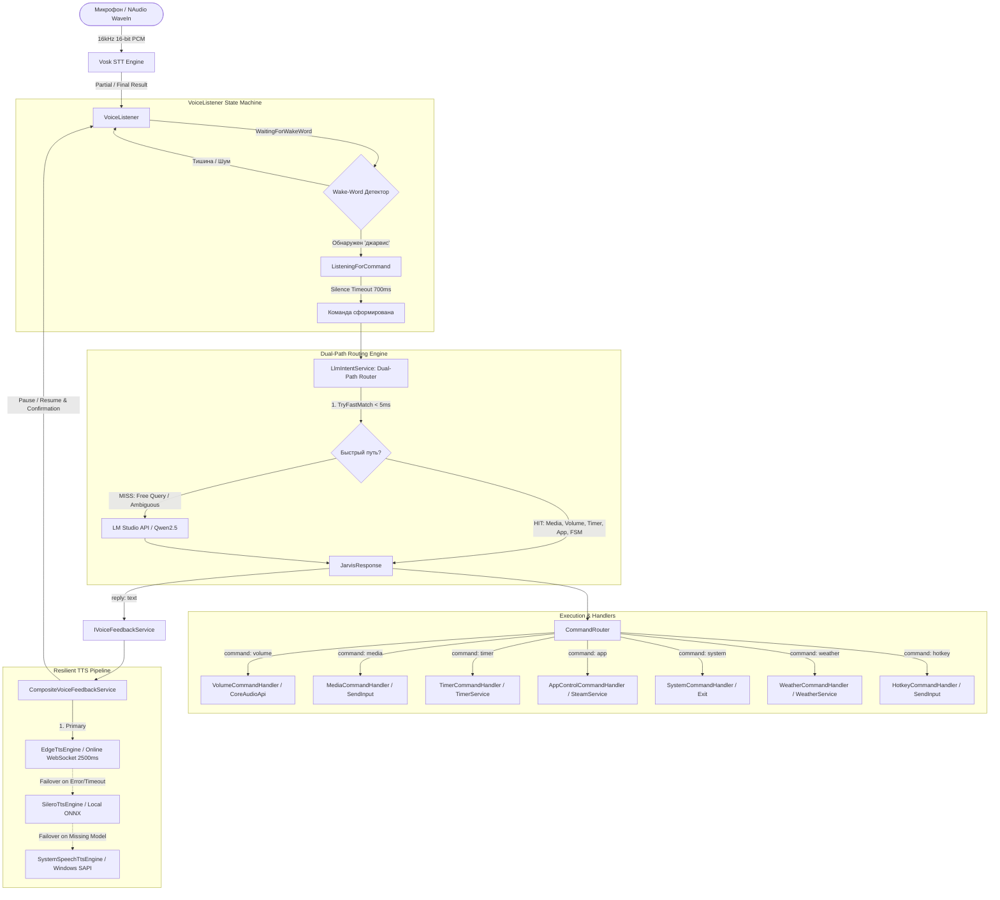
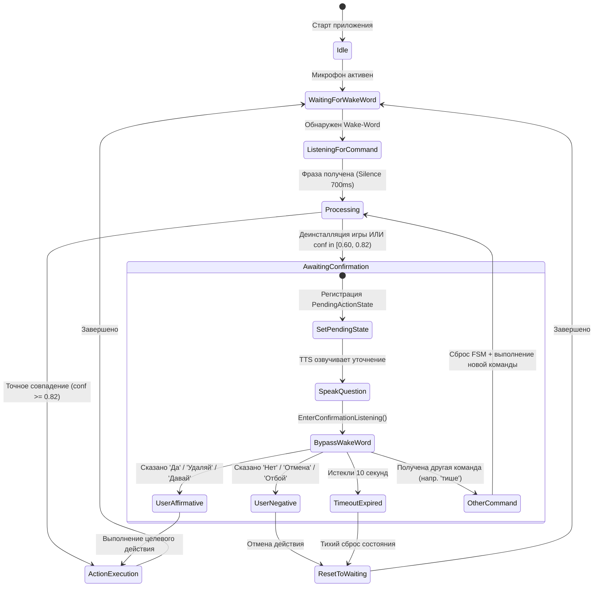

# JARVIS — Техническая карта архитектуры (ARCHITECTURE.md)

Документ предназначен для быстрой контекстной ориентации AI-агента в среде AntiGravity IDE. Содержит схемы пайплайна, порядок диспетчеризации, каталог сервисов, описание FSM-состояний и правила разработки для будущих задач.

---

## 1. High-Level Flow (Пайплайн голосового запроса)

Полный жизненный цикл обработки пользовательского ввода: от снятия звука с аудиокарты до выполнения низкоуровневых Win32-действий и голосового ответа.



### Пошаговое прохождение запроса:
1. **Захват звука (`VoiceListener.cs`)**: Поток PCM 16 кГц передается в `Vosk.Model` (синглтон).
   - В консоль выводятся реальные трейсы распознавания: `[STT: Vosk Partial]` и `[STT: Vosk Final]`.
2. **Детекция активации**:
   - В состоянии `WaitingForWakeWord` сканируются вейк-ворды (`джарвис`, `алиса`, `компьютер` и др.).
   - При обнаружении вейк-ворда слушатель переходит в `ListeningForCommand` (HUD переключается в `Listening`).
   - При истечении тишины (700 мс после окончания речи) формируется итоговая строка фразы без дробления слов на паузах.
3. **Dual-Path Диспетчеризация (`LlmIntentService.cs`)**:
   - Сначала вызывается `TryFastMatch(spokenText)` (выполняется строго `< 5 мс`, без сетевых запросов).
   - Системные приложения (`browser`, `notepad`, `calc`, `explorer`, `discord`, `telegram`, `steam`) проверяются **до** обобщенного поиска игр Steam, полностью исключая ложноположительные коллизии (например, «открой браузер» $\to$ «Graveyard Keeper»).
   - Выводятся трейсы маршрутизации: `[Router: FastMatch] Анализ фразы: ...` и `[Router: FastMatch] HIT -> ...` или `[Router: FastMatch] MISS -> Перенаправление в LLM (InterpretAsync)...`.
   - Если совпадение найдено, формируется типизированный `JarvisResponse` с объектом `CommandRequest` и текстом `Reply`.
   - Если быстрое совпадение отсутствует, запрос уходит в `InterpretAsync()` к локальной LLM (LM Studio / OpenAI-compatible API).
4. **Маршрутизация (`CommandRouter.cs`)**:
   - Если в ответе присутствует `CommandRequest`, роутер логирует `[Router: Dispatch] Маршрутизация команды...`, находит зарегистрированный `ICommandHandler` и вызывает `ExecuteAsync()`, после чего логирует `[Router: Result]`.
5. **Голосовой синтез (`IVoiceFeedbackService` / `CompositeVoiceFeedbackService.cs`)**:
   - Все обработчики и пайплайн вызывают единую абстракцию `IVoiceFeedbackService.SpeakAsync(text)`.
   - Оркестратор пытается синтезировать речь через первичный `EdgeTtsEngine` (`ru-RU-DmitryNeural`, строгий таймаут 2500 мс на подключение и первый пакет аудио).
   - При сбое сети или таймауте логируется `[TTS: Warning]` и управление передается `SileroTtsEngine` (локальный ONNX). Если модель отсутствует, происходит прозрачный переход на аварийный `SystemSpeechTtsEngine`.
   - На время речи микрофон `VoiceListener` глушится во избежание самоперехвата (Acoustic Feedback Prevention).
   - Если действие требует подтверждения пользователя (`HasPendingAction`), вопрос подтверждения озвучивается ровно один раз, дублирующий `response.Reply` блокируется, а микрофон переводится в режим прямого ожидания ответа без вейк-ворда (`EnterConfirmationListening`).

---

## 2. Dual-Path Routing & Order of Execution

Для исключения регрессий и гонок между регулярными выражениями в `TryFastMatch()` зафиксирован строгий порядок приоритетов.

| Приоритет | Категория | Обработчик / Сервис | Типичные фразы | Почему этот приоритет |
|---|---|---|---|---|
| **1** | **PendingAction (FSM)** | `JarvisOrchestrator` | `да`, `нет`, `отмена`, `удаляй`, `запускай` | **Критический**: предотвращает перехват слов согласия/отмены медиаплеером, таймером или отправку в LLM. |
| **2** | **Media Keys** | `MatchMediaCommand` / `MediaKeyService` | `пауза`, `стоп`, `музыка`, `запусти музыку`, `поставь трек`, `поставь песню`, `следующий трек`, `предыдущий` | **0 мс задержка**: Win32 SendInput клавиш `VK_MEDIA_*`. Regex-паттерн с `$`-якорем исключает перехват имён игр Steam. Изолирован от поиска приложений. |
| **3** | **Volume / Audio** | `VolumeCommandHandler` / `NAudio` | `тише`, `громче`, `звук 50`, `выключи звук`, `мут` | Высокочастотные системные команды, не требующие работы парсера таймеров или Steam. |
| **4** | **Timers & Reminders** | `MatchTimerCommand` / `TimerService` | `поставь таймер на 10 минут`, `напомни через 5 мин`, `сколько осталось` | Быстрый regex-парсер времени. Проверяется до Steam во избежание коллизий типа *"поставь таймер"* vs *"поставь киберпанк"*. |
| **5** | **System / Hotkeys / Apps** | `AppHandler` / `AppControlCommandHandler` / `HotkeyCommandHandler` | `закройся`, `открой браузер`, `проводник`, `блокнот`, `сверни все`, `открой калькулятор` | Управление окнами, процессами и системными программами. Строго изолировано от каталога Steam во избежание ложных коллизий. |
| **6** | **SteamService** | `SteamService` | `установи киберпанк`, `запусти ведьмак`, `удали астра ниро` | Фонетический поиск, Levenshtein, запуск или инициация диалога подтверждения деинсталляции/установки. |
| **7** | **LLM Fallback** | `LlmIntentService.InterpretAsync` | Свободный диалог, извлечение городов, нетривиальные намерения | Резервный канал при возврате `null` из `TryFastMatch()`. |

---

## 3. Каталог файлов, сервисов и зон ответственности

### 3.1 Ядро (`Core/`)
- [`Core/ICommandHandler.cs`](file:///c:/Users/evsee/OneDrive/Desktop/Gem/Core/ICommandHandler.cs): Единый интерфейс для всех обработчиков (`CommandName`, `ExecuteAsync`).
- [`Core/CommandRequest.cs`](file:///c:/Users/evsee/OneDrive/Desktop/Gem/Core/CommandRequest.cs): Неизменяемый DTO входящей команды (`Command`, аргументы `Args` в формате `JsonElement`).
- [`Core/CommandResult.cs`](file:///c:/Users/evsee/OneDrive/Desktop/Gem/Core/CommandResult.cs): Результат исполнения (`Success`, `Message`, `Data`). Фабричные методы `Ok()` и `Fail()`.
- [`Core/CommandRouter.cs`](file:///c:/Users/evsee/OneDrive/Desktop/Gem/Core/CommandRouter.cs): Диспетчер команд. Регистрация через fluent API `.Register()`, валидация JSON и асинхронная маршрутизация.
- [`Core/JarvisState.cs`](file:///c:/Users/evsee/OneDrive/Desktop/Gem/Core/JarvisState.cs): Enum состояний HUD: `Idle`, `Listening`, `Thinking`, `Action`.

### 3.2 Сервисы (`Services/`)
- [`Services/VoiceListener.cs`](file:///c:/Users/evsee/OneDrive/Desktop/Gem/Services/VoiceListener.cs):
  - Потоковый захват микрофона (`NAudio.Wave.WaveInEvent`, 16 кГц, 1 канал, 16 бит).
  - Потокобезопасный синглтон акустической модели Vosk (`_sharedModel`), исключающий утечки неуправляемой памяти.
  - Оптимизация каталога модели (`rescore` / `rnnlm` изоляция) для удержания RAM < 1.5 ГБ.
  - FSM состояний распознавания: `WaitingForWakeWord` $\leftrightarrow$ `ListeningForCommand` с сессионной буферизацией фраз (накопление слов через `isFinal`/`PartialResult` до таймаута естественной тишины 700 мс без промежуточного `recognizer.Reset()`).
  - Метод `EnterConfirmationListening()` для захвата ответа без произнесения вейк-ворда.
- [`Services/LlmIntentService.cs`](file:///c:/Users/evsee/OneDrive/Desktop/Gem/Services/LlmIntentService.cs):
  - Метод `TryFastMatch()`: 0 мс роутинг команд без обращения к LLM.
  - Интеграция с локальной LLM по стандарту OpenAI Chat Completions API (`POST /v1/chat/completions`).
  - Системный промпт с JSON-схемой и скользящая история диалога (до 6 сообщений).
- [`Services/JarvisOrchestrator.cs`](file:///c:/Users/evsee/OneDrive/Desktop/Gem/Services/JarvisOrchestrator.cs):
  - Координатор диалоговых состояний и FSM подтверждений (`PendingActionState`).
  - Метод `SetPendingConfirmation()` и детектор ответов `IsAffirmativeReply()` / `IsNegativeReply()`.
  - 10-секундный таймер автосброса незавершенного ожидания ответа (`CancellationTokenSource`).
- [`Services/SteamService.cs`](file:///c:/Users/evsee/OneDrive/Desktop/Gem/Services/SteamService.cs):
  - Индексация библиотек Steam (реестр Windows, `libraryfolders.vdf`, манифесты `appmanifest_*.acf`).
  - Парсинг флагов состояния манифестов `StateFlags`: учет игр в процессе установки/загрузки и полностью установленных (`StateFlags != 1 && StateFlags > 0`).
  - Фонетическая нормализация Vosk: транслитерация (En $\leftrightarrow$ Ru), очистка командных префиксов («удали», «деинсталлируй», «сноси») и нечеткий поиск Левенштейна.
  - Пороги уверенности: $\ge 0.82$ — точное действие; $[0.60, 0.82)$ — запрос подтверждения; $< 0.60$ — игра не найдена.
  - Поиск установленных игр для деинсталляции (`FindInstalledGame`): нечеткое сопоставление по имени, транслиту и алиасам среди установленных игр и манифестов с автоинициацией диалога подтверждения («Вы действительно хотите удалить {GameTitle}, сэр?») и переходом в режим прямого ожидания ответа без вейк-ворда (`EnterConfirmationListening`).
  - Автоматизация установки (`InstallGameAsync`) с визуальным поиском синей кнопки через сканирование `Bitmap` окна.
  - Автоматизация деинсталляции (`UninstallGameAsync`) через протокол `steam://uninstall/{appId}`: строгая фильтрация HWND модального диалога Steam (проверка PID процессов `steam`/`steamwebhelper`, заголовков «Удаление»/«Uninstall» и Rect), визуальный поиск центра синей кнопки подтверждения в нижней левой части окна и клик мыши без использования нестабильных эмуляций `Enter` / `VK_RETURN`.
- [`Services/TimerService.cs`](file:///c:/Users/evsee/OneDrive/Desktop/Gem/Services/TimerService.cs):
  - Потокобезопасная коллекция `ConcurrentDictionary<Guid, ActiveTimer>`.
  - Фоновые воркеры на `Task.Delay` с индивидуальными `CancellationTokenSource`.
  - Голосовое оповещение по завершении через `CompositeVoiceFeedbackService`.
- [`Services/MediaKeyService.cs`](file:///c:/Users/evsee/OneDrive/Desktop/Gem/Services/MediaKeyService.cs):
  - Мгновенная симуляция мультимедиа-клавиш через Win32 `SendInput` (события `KEYEVENTF_KEYDOWN` + `KEYEVENTF_KEYUP`).
  - Методы: `PlayPause()`, `NextTrack()`, `PrevTrack()`, `Stop()`.
- [`Services/AppHandler.cs`](file:///c:/Users/evsee/OneDrive/Desktop/Gem/Services/AppHandler.cs):
  - Централизованное исполнение ответов `HandleJarvisResponseAsync`.
  - Словари сопоставления алиасов приложений и процессов (`SteamGames`, `SteamProcessNames`, `AppTargets`).
- [`Services/WeatherService.cs`](file:///c:/Users/evsee/OneDrive/Desktop/Gem/Services/WeatherService.cs):
  - Асинхронный клиент прогноза погоды Open-Meteo API с геокодингом городов.
- [`Services/AppSettingsService.cs`](file:///c:/Users/evsee/OneDrive/Desktop/Gem/Services/AppSettingsService.cs):
  - Загрузка, сохранение и валидация конфигурации из `appsettings.json`.

### 3.3 Синтез речи (`Services/TTS/`)
- [`Services/TTS/IVoiceFeedbackService.cs`](file:///c:/Users/evsee/OneDrive/Desktop/Gem/Services/TTS/IVoiceFeedbackService.cs):
  - Единый контракт голосовой обратной связи для всех обработчиков команд и сервисов ассистента.
  - Определяет методы `SpeakAsync(text, ct)`, `Speak(text)`, свойства движков (`EdgeEngine`, `SileroEngine`, `SystemSpeechEngine`, `LastUsedEngineName`), события `OnSpeakingStarted` / `OnSpeakingFinished` и наследует `IDisposable`.
- [`Services/TTS/ITtsEngine.cs`](file:///c:/Users/evsee/OneDrive/Desktop/Gem/Services/TTS/ITtsEngine.cs): Базовый контракт движка (`Name`, `IsAvailable`, `SpeakAsync`).
- [`Services/CompositeVoiceFeedbackService.cs`](file:///c:/Users/evsee/OneDrive/Desktop/Gem/Services/CompositeVoiceFeedbackService.cs):
  - Реализует `IVoiceFeedbackService`.
  - Гибридный оркестратор с цепочкой отказоустойчивости:
    1. **Primary**: `EdgeTtsEngine` (высокое качество нейросети, онлайн, строгий таймаут 2500 мс на соединение и первый пакет аудио).
    2. **Secondary**: `SileroTtsEngine` (быстрый локальный оффлайн-синтез ONNX).
    3. **Safety Fallback**: `SystemSpeechTtsEngine` (Windows SAPI, доступен всегда).
  - Быстрое переключение при сетевом сбое (< 1.5 с) благодаря прерыванию соединения и отсутствию блокировок.
  - Потокобезопасный `SemaphoreSlim(1, 1)` для сериализации речи.
  - Детальное логирование каждого шага: `[TTS] Попытка синтеза...`, `[TTS: Edge] Воспроизведение завершено.`, `[TTS: Warning] Сбой...`, `[TTS: Error]`.
  - Координация с Vosk: пауза микрофона перед речью, 300 мс кулдаун для затухания акустического эха, активация `EnterConfirmationListening` при наличии активного `PendingAction`.
- [`Services/TTS/EdgeTtsEngine.cs`](file:///c:/Users/evsee/OneDrive/Desktop/Gem/Services/TTS/EdgeTtsEngine.cs): WebSocket-клиент Edge Speech, генерация DRM-токена `Sec-MS-GEC`, настраиваемый таймаут подключения и ожидания первого пакета аудио (по умолчанию 2500 мс из `TtsConfig.ConnectionTimeoutMs`), автоматический сброс сокета (`ResetClient()`) при разрыве/зависании и мгновенный проброс `WebSocketException`.
- [`Services/TTS/SileroTtsEngine.cs`](file:///c:/Users/evsee/OneDrive/Desktop/Gem/Services/TTS/SileroTtsEngine.cs): Локальный ONNX Runtime движок, генерация PCM 24/48 кГц.
- [`Services/TTS/SystemSpeechTtsEngine.cs`](file:///c:/Users/evsee/OneDrive/Desktop/Gem/Services/TTS/SystemSpeechTtsEngine.cs): Надежный fallback на системный `System.Speech.Synthesis.SpeechSynthesizer`.

### 3.4 Обработчики команд (`Handlers/`)
Все обработчики получают экземпляр `IVoiceFeedbackService` через внедрение зависимостей (DI) в конструкторе, что устраняет обход синтеза и гарантирует прохождение через первичный Edge-TTS с безопасным откатом:
- [`Handlers/VolumeCommandHandler.cs`](file:///c:/Users/evsee/OneDrive/Desktop/Gem/Handlers/VolumeCommandHandler.cs): Управление мастер-громкостью через NAudio `MMDeviceEnumerator` и `IAudioEndpointVolume` (`set`, `change`, `mute`, `get`).
- [`Handlers/MediaCommandHandler.cs`](file:///c:/Users/evsee/OneDrive/Desktop/Gem/Handlers/MediaCommandHandler.cs): Обработка мультимедиа-команд через `MediaKeyService`.
- [`Handlers/TimerCommandHandler.cs`](file:///c:/Users/evsee/OneDrive/Desktop/Gem/Handlers/TimerCommandHandler.cs): Управление таймерами (`set`, `cancel`, `status`) через `TimerService` (с инжекцией `IVoiceFeedbackService`).
- [`Handlers/AppControlCommandHandler.cs`](file:///c:/Users/evsee/OneDrive/Desktop/Gem/Handlers/AppControlCommandHandler.cs): Запуск, закрытие, проверка статуса и деинсталляция игр/приложений (с инжекцией `IVoiceFeedbackService`). Содержит реестр канонических системных приложений (`browser`, `explorer`, `notepad`, `calc`, `discord`, `telegram`, `steam`), разрешение браузера по умолчанию через реестр Windows (`UrlAssociations\\https\\UserChoice` / `cmd /c start`), строгую изоляцию от каталога Steam во избежание ложных коллизий и асинхронный запуск `StartApplicationAsync` с защитой от повторного озвучивания. **Таблица медиа-алиасов `_mediaAliases`** (`музыка`, `трек`, `песня`, `плеер` и аналоги): при получении от LLM команды `app/start/музыка` вместо `Process.Start` делегирует исполнение в `MediaKeyService.PlayPause()`, предотвращая `Win32Exception`.
- [`Handlers/HotkeyCommandHandler.cs`](file:///c:/Users/evsee/OneDrive/Desktop/Gem/Handlers/HotkeyCommandHandler.cs): Симуляция системных сочетаний клавиш (Ctrl+C, Ctrl+V, Win+D, Win+Shift+S, Ctrl+Shift+Esc).
- [`Handlers/SystemCommandHandler.cs`](file:///c:/Users/evsee/OneDrive/Desktop/Gem/Handlers/SystemCommandHandler.cs): Выход из ассистента (`action: close`, `name: jarvis`, с инжекцией `IVoiceFeedbackService`).
- [`Handlers/WeatherCommandHandler.cs`](file:///c:/Users/evsee/OneDrive/Desktop/Gem/Handlers/WeatherCommandHandler.cs): Получение прогноза погоды и голосовое озвучивание отчета строго через `IVoiceFeedbackService`.

### 3.5 Win32 и нативный слой (`Win32/`)
- [`Win32/NativeMethods.cs`](file:///c:/Users/evsee/OneDrive/Desktop/Gem/Win32/NativeMethods.cs): P/Invoke импорты `user32.dll` (`SendInput`, `MapVirtualKey`, `keybd_event`, `FindWindowEx`, `EnumWindows`, `GetWindowRect`, `SetForegroundWindow`).
- [`Win32/NativeStructs.cs`](file:///c:/Users/evsee/OneDrive/Desktop/Gem/Win32/NativeStructs.cs): Структуры Win32 `INPUT`, `KEYBDINPUT`, `MOUSEINPUT`, константы кодов виртуальных клавиш `VK_*`.
- [`Win32/KeyboardHook.cs`](file:///c:/Users/evsee/OneDrive/Desktop/Gem/Win32/KeyboardHook.cs): Низкоуровневые хуки и утилиты ввода.

### 3.6 Подсистема консоли и диагностического логирования
- **Гибридный запуск `<OutputType>Exe</OutputType>`**: В `Gem.csproj` подсистема настроена на `Exe` вместо `WinExe`, что гарантирует автоматическое подключение стандартных потоков терминала (PowerShell / CMD / Windows Terminal) без отсоединения дескрипторов при сохранении полноценного WPF HUD Overlay.
- **Кодировка UTF-8**: В `Program.cs` при старте принудительно задаются `Console.OutputEncoding = Encoding.UTF8` и `Console.InputEncoding = Encoding.UTF8` до создания потоков вывода, исключая искажение кириллицы.
- **Microsoft.Extensions.Logging**: Интеграция консольного провайдера `AddConsole()` с привязкой уровней из секции `Logging` файла `appsettings.json` (`Logging:LogLevel:Gem = Debug`).
- **Сквозные маркеры трейсинга**:
  - `[STT: Vosk Partial]` / `[STT: Vosk Final]` — распознавание речи микрофоном в реальном времени.
  - `[Router: FastMatch]` — трейсинг детерминированного роутинга (`HIT` с именем команды или `MISS` с отправкой в LLM).
  - `[Router: Dispatch]` / `[Router: Result]` — исполнение команд в `CommandRouter`.
  - `[TTS]`, `[TTS: Edge]`, `[TTS: Silero]`, `[TTS: System.Speech]`, `[TTS: Warning]`, `[TTS: Error]` — каждый этап синтеза и отказоустойчивого переключения.

---

## 4. FSM и контекстные диалоговые состояния (`PendingActionState`)

Когда ассистент выполняет деструктивное действие (удаление игры) или сомневается в распознанном названии (зона уверенности $[0.60, 0.82)$), активируется конечный автомат ожидания подтверждения.



### Детали механики `PendingActionState`:
1. **Регистрация состояния**:
   Вызывается `JarvisOrchestrator.Instance.SetPendingConfirmation(action, gameInfo, ttsService)`. В объект сохраняются тип действия (`Install`, `Start`, `Uninstall`), `AppId` и название игры.
2. **Байпас ключевого слова (Wake-Word Bypass)**:
   При завершении озвучивания вопроса («Вы действительно хотите удалить {Game}, сэр?») блок `finally` в `CompositeVoiceFeedbackService` проверяет `HasPendingAction`. Если `true`, вызывается:
   ```csharp
   VoiceListener.Instance.EnterConfirmationListening("Awaiting confirmation reply (bypassing wake-word)...");
   ```
   Микрофон сразу переводится в `VoiceListenerState.ListeningForCommand`. Пользователю **не нужно** говорить «Джарвис».
3. **Обработка быстрых ответов**:
   - **Согласие** (`IsAffirmativeReply`): `да`, `давай`, `подтверждаю`, `устанавливай`, `запускай`, `удаляй`, `деинсталлируй`, `сноси`, `верно`, `хорошо`. Запускается запланированная операция.
   - **Отказ** (`IsNegativeReply`): `нет`, `отмена`, `не надо`, `отбой`, `стой`, `не то`, `отставить`. Действие отменяется с голосовым уведомлением.
4. **Тайм-аут и сброс**:
   - Запускается 10-секундный таймер (`StartConfirmationTimeout` через `CancellationTokenSource`).
   - Если за 10 секунд пользователь ничего не сказал, FSM тихо сбрасывается (`ResetConfirmationState()`), и слушатель возвращается в режим ожидания вейк-ворда.
   - Если пользователь произносит постороннюю команду (например, *"сделай тише"*), FSM немедленно сбрасывается, а команда передается дальше по цепочке роутинга.

---

## 5. Контракты и правила проектирования для будущих задач

Каждый AI-агент, работающий с проектом, обязан строго соблюдать следующие архитектурные инварианты:

### Правило 1. Бюджет задержки `TryFastMatch` (< 5 мс)
- Любая детерминированная команда (медиа, системные звуки, таймеры, горячие клавиши) регистрируется в `TryFastMatch()`.
- Внутри `TryFastMatch()` **запрещены**:
  - Сетевые HTTP-запросы и обращение к LLM API.
  - Блокирующие дисковые операции ввода-вывода (I/O).
  - Тяжелые или неоптимизированные Regex без `RegexOptions.Compiled` / `RegexOptions.IgnoreCase`.
- Время выполнения полного прохода `TryFastMatch()` должно составлять **менее 5.0 мс** на 1000 вызовов (проверяется регрессионными бенчмарками).

### Правило 2. Оформление команд через `ICommandHandler`
- Новые функциональные модули оформляются как самостоятельные классы в папке `Handlers/`, реализующие интерфейс `ICommandHandler`.
- Регистрация происходит централизованно в `Program.cs` через `CommandRouter.Register(new MyHandler())`.
- Имя команды (`CommandName`) должно быть уникальным, компактным и нижнерегистровым (например: `volume`, `media`, `timer`, `app`, `hotkey`, `weather`, `system`).

### Правило 3. Конфигурация исключительно через `appsettings.json`
- Никаких захардкоженных API-ключей, сетевых URL, путей к моделям или голосов TTS в коде.
- Все параметры добавляются в `appsettings.json`, маппятся в классы DTO в `AppSettingsService.cs` и инжектируются через `IConfiguration`.

### Правило 4. Запрет на коммит тяжелых бинарников и моделей в Git
- Каталоги `model/` (Vosk), `Models/TTS/` (Silero ONNX), кэши, временные аудиофайлы (`*.wav`, `*.mp3`) и сборки (`bin/`, `obj/`) строго занесены в `.gitignore`.
- Для развертывания моделей используются скрипты автоматической загрузки (например, `dotnet run -- --download-model`).

### Правило 5. Координация TTS, единый контракт `IVoiceFeedbackService` и инвариант однократного озвучивания
- Любой голосовой вывод ассистента обязан проходить через `IVoiceFeedbackService.SpeakAsync()` (реализованный в `CompositeVoiceFeedbackService`).
- Прямой вызов синтезаторов минуя `IVoiceFeedbackService` строго запрещен, так как это нарушает механизм глушения микрофона (acoustic echo cancellation), ломает диалоговую машину подтверждений и приводит к утечке неуправляемых ресурсов.
- Низкоуровневые доменные сервисы (включая `SteamService`) не должны вызывать голосовой вывод напрямую — инициирование озвучивания выполняется строго на уровне `ICommandHandler` или `HandleJarvisResponseAsync`.
- Инвариант однократного озвучивания: если команда инициирует диалог подтверждения (`JarvisOrchestrator.Instance.HasPendingAction == true`), озвучивается только уточняющий вопрос («Вы имели в виду {Game}, сэр?»), а `response.Reply` в `HandleJarvisResponseAsync` блокируется.
- Системные приложения (`browser`, `notepad`, `calc`, `explorer`) изолируются в роутинге от библиотеки игр, чтобы исключать паразитные подтверждения и ложные сопоставления.
- Обработчики команд обязаны запрашивать `IVoiceFeedbackService?` через внедрение зависимостей в конструкторе.

### Правило 6. Запрет на пустые `catch { }` блоки
- Во всех модулях проекта категорически запрещены «немые» перехваты исключений `catch { }` без логирования.
- Любое подавление ошибки должно сопровождаться детальным выводом в консоль или трассировкой через `System.Diagnostics.Debug.WriteLine` с указанием контекста сбоя и `ex.Message`.
